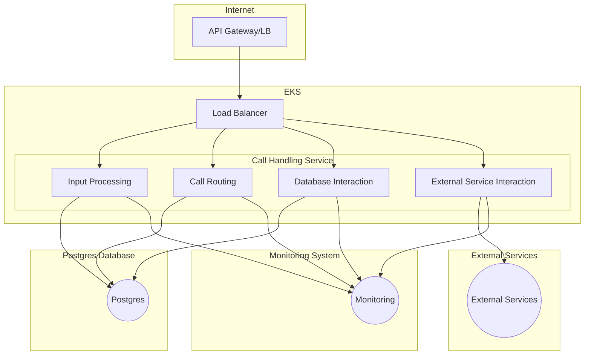
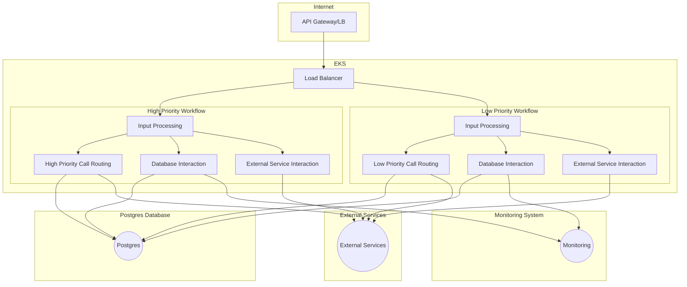

### Vision:
In an ideal scenario, the service would embody high availability, scalability, and cost-efficiency, catering to both mobile and PBX systems. It should minimize downtime, ensuring vital services like ambulance communication remain uninterrupted. The architecture should be modular, facilitating seamless deployment in new regions while maintaining peak performance.

### Architecture Overview:
**Key Components:**
- **API Gateway:** Handles incoming HTTP POST requests for call initiation.
- **Load Balancer:** Distributes incoming traffic across multiple instances for scalability and availability.
- **Call Handling Service-Input Processing:** Processes call requests, hand it over to call routing, and sends responses.
- **Call Handling Service-Call Routing:** Determines the destination for incoming calls based on predefined rules or dynamic factors.
- **Call Handling Service-Database interaction:** Stores and retrieves call data, configuration settings, and user preferences.
- **Call Handling Service-External Services Handler:** Interfaces with external services for call routing decisions.
- **Database (Postgres):** Stores call data and configuration information.
- **Monitoring System:** Monitors service health, performance, and resource utilization (consider integrating with existing solutions such as Grafana).

### Architecture Diagram:

#### Input Processing:

Upon receiving a call initiation request, the Call Handling Service processes the incoming data to extract relevant information such as caller ID, destination number, call type, and any additional metadata, including validation and normalization of input parameters. Input processing ensures that the call request is correctly formatted and contains all necessary details for further handling and routing.

#### Call Routing:

Once the input data is processed, the Call Handling Service determines the appropriate routing strategy based on predefined rules, configurations.

#### Database Interaction:

The Call Handling Service interacts with the database to store and retrieve call-related data, configuration settings, user preferences, and other relevant information. Database interactions may include querying call logs, updating call routing rules, storing user profiles or preferences, and logging call-related events for auditing or reporting purposes.

#### External Service Interaction:

Call Handling Service may interact with external services or APIs

#### Error Handling and Resilience:

The Call Handling Service should be designed to handle errors gracefully and ensure resilience against failures or unexpected conditions. This includes implementing mechanisms for error detection, logging, and reporting, as well as implementing fallback strategies or failover mechanisms to maintain service continuity and minimize impact on users in case of failures.

#### Scalability and Performance:

The architecture of the Call Handling Service should be designed to scale horizontally to accommodate increasing call volumes and ensure optimal performance under varying workloads, implementing load balancing and auto-scaling mechanisms to distribute traffic and resources efficiently.

#### Security:
The Call Handling Service should implement robust security measures to protect sensitive call data, user information, and system resources from unauthorized access, data breaches, or other security threats. This includes implementing encryption, access controls, authentication, and authorization mechanisms, as well as monitoring and auditing security events to detect and respond to potential security incidents.

#### Single pod for entire service vs. multiple pods for different components:
- Single Pod: Easier to manage, deploy, and monitor. However, it may limit scalability and fault isolation. Could consider this for smaller deployments.
- Multiple Pods: Facilitates scalability, fault isolation, and independent deployment of different components. However, it increases complexity in managing inter-component communication, service discovery, and resource allocation. Suitable for larger, more complex services requiring high availability and scalability. Also Need to consider communication between components in separate pods, via service discovery/message queue/api calls/shared datastore.

### High/low priority call handling:

To make the emergecy call more reliable, we can have two workflows, one for high priority calls and one for low priority calls. High priority calls can be routed through a separate workflow with higher priority in the call routing logic, faster processing, and dedicated resources to ensure timely handling. Low priority calls can be routed through a separate workflow with lower priority in the call routing logic, handling normal calls.

For this two workflows they use the same application software but different configurations to handle the calls, for high priority calls we may have more relaxed rules for validation and auditing to ensure faster/reliable processing, as long as we have the mandatory information to handle the call.  

### Deployment Strategy:
- Deploy new versions of the service alongside the existing one, gradually routing traffic to the new version.
- Utilize database migration scripts to manage schema changes during deployments.
- Implement rollback procedures to revert to the previous version in case of issues.

### Monitoring:
- **Application Monitoring:** Monitor service metrics such as response time, error rates, and throughput.
- **Infrastructure Monitoring:** Monitor resource utilization of AWS EKS nodes and the Postgres database.
- Set up alerts for critical service and infrastructure metrics to promptly detect and respond to issues.

### Cost Optimization:
- **Horizontal Pod Autoscaler (HPA):** Define HPA objects in Kubernetes to automatically scale the number of pods based on metrics like CPU or memory usage, ensuring efficient resource utilization.
- **Cluster Auto-Scaler:** Integrate with AWS EKS to automatically adjust the size of the Kubernetes cluster based on resource demand.
- **AWS RDS for PostgreSQL:** Utilize Reserved Instances with discounts, provisioned IOPS, and enable auto-scaling for storage to optimize costs further.

### Scalability:
Utilize auto-scalers as mentioned above.

### Availability:
- Deploy the service across multiple availability zones for high availability.
- Implement failover mechanisms to automatically redirect traffic in case of instance or zone failures.
- Regularly back up data and implement disaster recovery procedures to ensure data integrity and service continuity.

### Resource Requirements:
- **Developers:** 2-3 developers skilled in Golang and AWS.
- **DevOps:** 1-2 DevOps engineers proficient in AWS/Kubernetes/Terraform.
